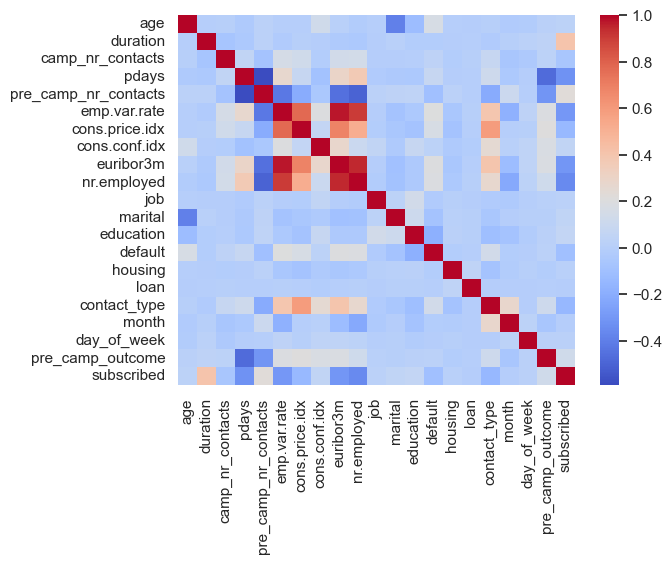
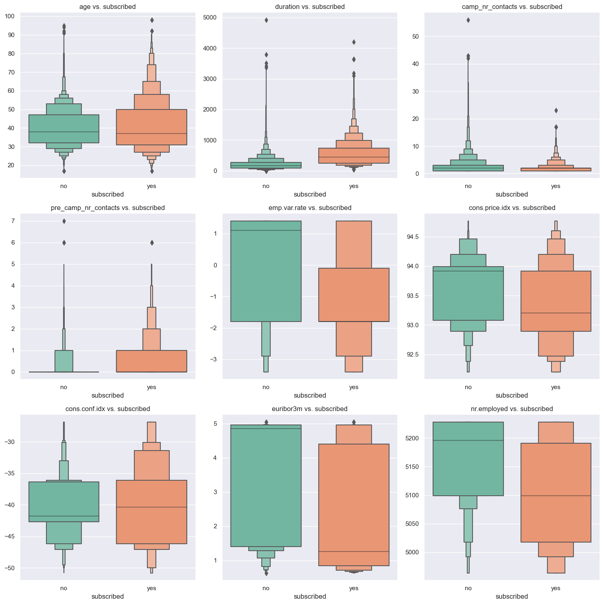
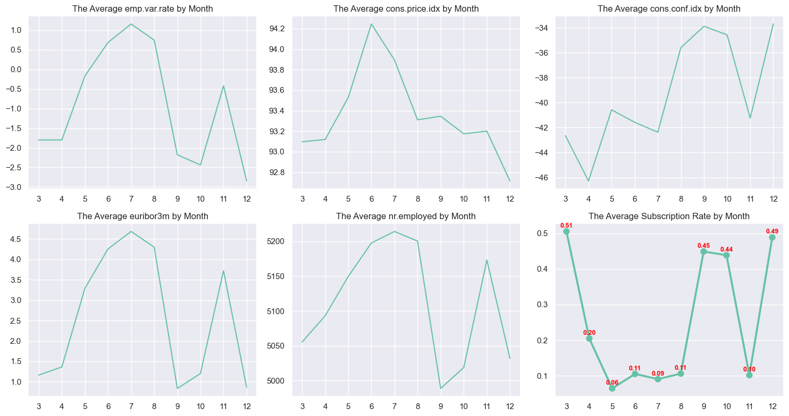

# Bank Marketing Subscription Prediction

A supervised learning classification project that predicts whether a bank client will subscribe to a term deposit using campaign, customer, and macroeconomic data from 41,188 outreach records.
<table>
  <tr>
    <td width="50%">
      
       
      Correlation analysis surfaced strong overlap among macroeconomic indicators and informed feature pruning.
    </td>
    <td width="50%">
      
       
      Distribution shifts helped identify which numerical features separated subscribers from non-subscribers.
    </td>
  </tr>
  <tr>
    <td colspan="2">
      
       
      Time-series analysis connected campaign timing to both conversion rate and broader economic conditions.
    </td>
  </tr>
</table>

| Focus | Summary |
| --- | --- |
| Business question | Which clients should a bank prioritize for term-deposit outreach? |
| Dataset | 41,188 campaign records, 21 raw columns, `11.27%` positive class rate |
| Selected model | `SVC` |
| Best business-fit result | `0.68` precision on actual subscribers (`class 1`) |
| Core skills | EDA, feature engineering, leakage prevention, model evaluation, deployment thinking |

## Overview

- Built an end-to-end supervised learning workflow on the [UCI Bank Marketing dataset](https://archive.ics.uci.edu/dataset/222/bank+marketing) to predict term-deposit subscription.
- Performed exploratory analysis, feature engineering, one-hot encoding, scaling, and multicollinearity checks before modeling.
- Benchmarked `GaussianNB`, `LogisticRegression`, `KNeighborsClassifier`, `DecisionTreeClassifier`, `RandomForestClassifier`, and `SVC` with 5-fold cross-validation on the training data and a stratified 70/30 train-test split.
- Chose `SVC` for the business use case because it delivered the highest precision on actual subscribers: `0.68` for class `1`.
- Rejected weaker models against the naive class-imbalance baseline (`88.73%` accuracy from always predicting "no").
- Created a Flask scoring prototype.

## Results

| Model | Test Accuracy | Precision on Subscribers | Recall on Subscribers |
| --- | ---: | ---: | ---: |
| Logistic Regression | 0.9005 | 0.67 | 0.23 |
| SVC | 0.9001 | 0.68 | 0.21 |
| Random Forest | 0.8947 | 0.56 | 0.31 |
| KNN | 0.8897 | 0.52 | 0.25 |

Key takeaway: although Logistic Regression edged out SVC on overall accuracy, SVC produced the best precision on the positive class, which is the more relevant outcome when the goal is to target higher-probability subscribers and reduce wasted outreach.

## Business Insights From EDA

- Subscription rate in the dataset was `11.27%`, so class imbalance materially affected evaluation.
- Clients under 30 or above 50 were more likely to subscribe than mid-range age groups.
- Students and retired clients converted at higher rates than larger segments such as blue-collar and admin clients.
- Cellular contact outperformed telephone contact.
- Subscription rates were stronger in March, September, October, and December.
- Lower macroeconomic indicators were associated with higher subscription rates during the campaign period.
- Clients with successful outcomes in previous campaigns were more likely to subscribe again.

## Technical Stack

`Python` `pandas` `NumPy` `matplotlib` `seaborn` `scikit-learn` `Flask`
